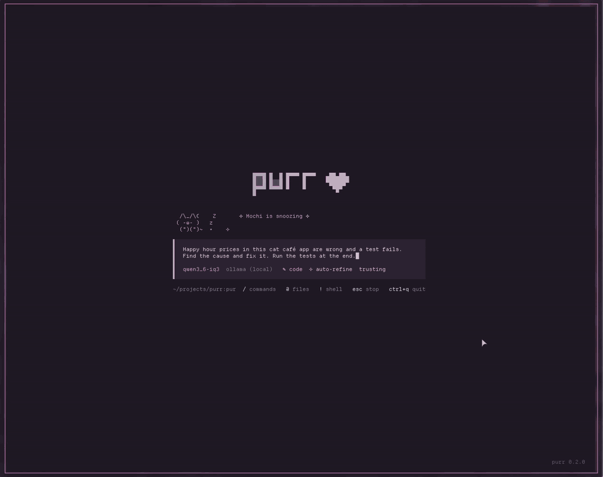

# purr ♡

A tiny coding agent for the terminal, made to get more out of **small local models** on **longer,
vaguely worded tasks**: it keeps their prompt lean, repairs their slips, checks their work and
pushes them to finish the whole job. It also works with the DeepSeek API and OpenRouter, where
it steps back (big models don't need the training wheels). The agent itself is plain Python;
the full-screen mode uses [Textual](https://textual.textualize.io/) (`uv sync` installs it into `.venv`).



```
purr                 # full-screen chat in the current folder
purr ~/projects/x    # chat in another folder
purr -m flash        # pick a model (names in config.toml)
purr --plain         # simple scrolling mode, no Textual needed
purr -p "fix the bug in mathy.py"   # one task, then exit
```

Drag over any text to copy it (ctrl+c copies a selection too; with nothing selected it stops an
answer or clears the box). In the message box: enter sends, ctrl+j makes a new line, up/down bring back old messages.
`/` opens the command menu, `@` picks a file to attach, `!command` runs a shell command yourself
(the model sees the output). Esc stops an answer, ctrl+q quits. Before edits and commands a popup
asks: y, a (always), n, or type what to do instead. A plain "n" ends the turn.

A little cat above the message box shows what purr is doing: thinking, exploring (reading,
grep), building (edits), running a command, talking, waiting for you, napping when idle.
While it works you see the time so far and the speed; at the end of every task:
`✓ 1m 12s · 45 tok/s · 3.2k tokens`. The speed only counts the time spent writing, not
the wait while the model reads the prompt. The cat's frames are in `tui/cat.py`.

She's yours: she's called Mochi until you rename her (`/cat name Luna`), she cheers when a
test run passes and gets a little sad when it fails, stretches when a task wakes her up, and
purrs when you click her. `/cat` shows how often she's been petted and how many tasks you've
done together. By day she wears a bow and naps in the sun; at night (following
`theme-switch`, or 18-06) she wears a moon and the stars come out.

| Command | |
|---|---|
| `/models`, `/model <name>` | switch model (list or by name) |
| `/clear` | forget the chat |
| `/compact` | summarise the chat to free up room (happens by itself at 85% full) |
| `/resume` | carry on an earlier chat (`purr -c` carries on the last one) |
| `/undo` | put back the files the last answer changed |
| `/init` | have the model write an AGENTS.md for the project |
| `/theme`, `/theme <name>` | colours: auto (day/night), plum, strawberry-milk, lilac-dream, bubblegum-night, cotton-candy (remembered) |
| `/cat`, `/cat name <name>` | your cat's card, or rename her |
| `/mode`, `/refine`, `/plan`, `/pr` | see below |
| `/files` or **ctrl+t** | the workbench: what changed this session, the project tree, a small editor (see below) |
| `/stats` | fun numbers: chats, streak, lines written, favourite model and project, night owl or early bird |
| `/cost`, `/trust`, `/help`, `/quit` | |

**Your own commands:** a markdown file per command in `~/.config/purr/commands/` (every project)
or `<project>/.purr/commands/`. The file name is the command, the text is sent to the model,
`$ARGUMENTS` becomes whatever you type after it. A first line `description: ...` shows in the menu.

**Notes for the model:** `~/.config/purr/AGENTS.md` (every project) and `AGENTS.md` in the
project are added to the system prompt.

**Tools the model has:** read_file, list_files, grep, fetch_url, edit_file, write_file, run,
todo (a task list you see), task (a read-only helper with a fresh memory, for exploring).
Commands in `[permissions] allow_run` (config.toml) run without asking; "always" on a command
covers that kind of command only (`git status`, not all of git).

## How it works

1. `harness/agent.py` sends the chat + the tool list to the model.
2. The model answers with text (done) or asks for tools.
3. `harness/tools.py` runs them (asking you before edits and commands) and adds the results to the chat.
4. Back to 1.

| File | What it does |
|---|---|
| `purr.py` | the command: starts the full-screen or plain mode |
| `tui/app.py`, `tui/purr.tcss` | the full-screen mode and its look |
| `tui/cat.py` | the cat: its moods and animation frames |
| `harness/agent.py` | the loop, system prompt, cost, compacting, sessions, helpers |
| `harness/commands.py` | the /commands (both modes use them) |
| `harness/api.py` | streams replies from any OpenAI-compatible API |
| `harness/tools.py` | the tools, permissions, undo |
| `harness/limits.py` | per-model limits, derived from the model's `context` |
| `harness/ui.py` | colours, diffs, the plain mode's view |
| `config.toml` | providers, models, prices |

Every chat is saved as JSON in `~/.local/state/purr/sessions/` (`PURR_STATE` moves it, for tests), so you can see exactly what
the model sent and got back. That's the best way to see why a model did something odd.

`AGENTS.md` in the project folder is added to the system prompt automatically.

The agent never prints anything itself: it calls a *view* (`thinking`, `text`, `tool`, `diff`,
`note`, `ask`, `status`). `ui.PlainView` prints to the terminal, `tui.app.TuiView` draws in
Textual. A new front end only needs those methods.

Local model quirks purr works around: edits with slightly wrong indentation still apply
(`_loose_match` in tools.py), and tool calls that Qwen writes as text
(`<function=...>`) get turned into real calls (`calls_from_text` in agent.py). Tool and argument
names from other harnesses work too (`search` is grep, `old_string` is old_text, ...), an
`edit_file` with only `content` rewrites the file, `\u003c` written out instead of `<` is undone,
and when an edit's text isn't found purr says which file it is in, or shows the closest lines.
`purr bench` counts these as "repaired".

purr also checks the model's work by itself (each can be switched off in config.toml):
after every edit a syntax check and ruff's bug checks (undefined names, functions defined twice, ...)
go straight into the tool result (`code_checks`); a rewrite with a `# ... rest unchanged`
placeholder, or one that shrinks a big file to a fraction, is refused once; when the model wants
to stop after changing files, purr runs the project's tests itself and asks it to check the
request point by point (`final_check`, `final_check_tests`; `.purr/test_command` sets the
command); every 8 steps it repeats the request (`reminders`); edits and overwrites need the
file read first (`read_before_edit`); and an edit that removes or changes what a test checks
gets a warning to fix the code instead (part of `code_checks`). `purr bench` counts the
problems the checks caught, and `purr-bare` runs purr without any of them.

The training wheels scale with the model: local models get auto-refine, reminders and the
edge-case step in the final check; API models (which `purr bench` showed don't need them; with
DeepSeek V4.1 Flash they only made purr slower) get a short final check instead. Setting
`refine`, `reminders` or `edge_cases` in config.toml (or `/refine ...`) overrides that.

## Free models: `/model free`

`/model free` lets purr pick the best free OpenRouter model for what you're doing, from the ranked
lists in `[free]` in `config.toml` (code: code/learn/pair/plan, ask, talk: chat/create), skipping
models too small for the chat. When a model is rate-limited, out of free requests for the day, or
has no host, purr says so in the chat, rests it (until midnight UTC for the daily cap, a few minutes
when it's busy; remembered in `~/.local/state/purr/free.json`) and sends the same request to the
next one. The model line shows `free → laguna`. `/free` lists the models and which are resting,
`/free reset` forgets the resting; picking a model by hand turns it off.

Besides OpenRouter, `config.toml` has the free tiers of **Groq, Cerebras, Google AI Studio (Gemini),
Mistral, NVIDIA and Cohere**, and the `[free]` rankings mix them all. A provider without a key is
simply skipped, so add keys as you get them: `purr --key groq` asks for the key without showing it
and keeps it in `~/.config/purr/keys.toml` (only you can read it; `key_page` in config.toml says
where to get one). OpenRouter's daily free cap is per account, so when it's hit every OpenRouter
model rests at once and another provider takes over. `/free check` sends each model one tiny
request and rests the ones that don't work (a renamed model, a key that's wrong), so a real turn
never lands on them. Free hosts may keep your
prompts, so check a model's page before using it on private code.

## MCP servers: helping small models understand the project

purr speaks MCP: every `[mcp.*]` table in `config.toml` is a server whose tools are offered next to
purr's own (`harness/mcp.py`; a server is started in the project folder the first time it's
needed, and one that fails is skipped). `tools = [...]` offers only some of a server's tools, and
tools that can change things ask you first, like `run`.

purr ships two of its own in `servers/` (plain Python, no packages, any MCP client can use them):

| server | tool | what it gives the model |
|---|---|---|
| codebase | `project_overview` | tech stack and versions, how to run and test (CI commands included), folders, entry points. Put in the system prompt instead of offered as a tool (~300 tokens for small models; `overview_in_prompt = false` turns it off) |
| | `outline` | a file's classes and functions with line ranges plus who uses the file (Godot scenes and autoloads too), so the model reads just the lines it needs; a folder gives the code map |
| | `find_symbol` | where something is defined and every place it's used |
| stack | `godot_class` | a class from the Godot you have installed: exact signatures (`godot --doctool`) plus that version's docs from GitHub, cached in `~/.cache/purr/godot/`; up the inheritance chain for one member; Godot 3 names get their Godot 4 name |
| | `python_api` | a package's function, class or module from the project's own `.venv`: signature, docs, version |

Few tools with short descriptions on purpose: every tool is sent with every request, so together
they add about 300 tokens a request on top of the overview.

The stack tools only show up where they fit (`godot_class` in Godot projects, `python_api` in Python
ones), since every tool costs a small model some context. To add your own, see `servers/mcpserver.py`:
a decorated function is a tool.

## Different models, different limits

purr adapts to the model it is running. The `context` in `config.toml` sets how big a
tool result may be, how many lines `read_file` returns by default, how many files or
grep matches are listed, how large an `@file` attachment may be, when the chat compacts
by itself, and how many recent tool results stay whole. A 32k local model gets small,
quick limits; a 1M API model gets much bigger ones. Any model can override a number
with a `limits = { ... }` table (`harness/limits.py` shows the keys and the defaults).

Two things that mostly bite small models:

- **Going in circles.** If the model makes the same tool call with the same arguments
  and gets nothing new, purr says so once. A failing call is stopped after 3 tries (4 on
  big models); one that works but gives the same thing (re-reading a file) gets 2 more.
  A test that fails with a different error each time is not a loop.
- **Old tool output.** Before summarising the whole chat, purr elides the contents of
  older tool results (keeping the newest ones whole), leaving a note of which call it
  was so the model can run it again. That frees room with no model
  call, so a small model spends its context on the current job rather than on output
  it has already read.

## DeepSeek

Put the key in `~/.zshrc`: `export DEEPSEEK_API_KEY=sk-...`, open a new terminal, then `/model flash`.
DeepSeek's cache makes repeated context almost free, as long as the start of the chat never
changes. purr only ever adds to the end of the chat, so that works out of the box.

## OpenRouter

Uses the key you saved with `opencode auth login openrouter` (or `OPENROUTER_API_KEY` if set;
DeepSeek works the same way). Models: `ds-pro-or`, `ds-flash-or`, `luna`, `sonnet`, `glm`,
`qwen-flash`, `kimi`. For another one, copy an entry in `config.toml` and change `id` and `price`
(both are on openrouter.ai). The cost purr shows is OpenRouter's real one.
Which hosts may answer is set once under `[providers.openrouter.body.provider]`: only well-known
hosts, no fp4 copies, the cheapest of those that do 100+ tok/s (the cheapest no-name hosts were
slow and went off the rails). OpenCode's config asks for the same, so `purr bench` stays fair.

## Modes, refining and pull requests

| mode | tools | for |
|---|---|---|
| ✎ code | all | doing the work (the default) |
| ◈ ask | read, list, search: edits and commands are blocked | explaining, planning |
| ✿ learn | all | learning: purr writes the boring parts and leaves the key lines to you as `TODO(you)` |
| ⇄ pair | all | pair programming: you take turns, one small step each |
| ✦ plan | two models | a big model makes tickets, a small one does them |
| ♡ chat | none, short prompt | just talking |
| ✧ create | none, a bit more random | ideas, names, game design, writing |

Switch with **shift+tab** or `/mode chat`. Each mode can bring its own model (`[mode_models]` in `config.toml`: here code → Qwen3.6 IQ3, ask → DeepSeek Flash, chat and create → Kimi); a model you pick with `/model` in a mode sticks to it for the session, and a model with no key keeps the current one. Refine has the model rewrite your message into a clear
task (Task / Where / Steps / Done when, from the project's file list) and shows it to you first:
ctrl+s sends it, ctrl+o sends yours. `/refine auto` (the default) does that only for a short first
message, a new task said in a few words, where it helped most in `purr bench` (Qwen3.6 IQ3 went
from 3/5 to 5/5 hard tasks from vague asks); `/refine on` refines every message, `/refine off` none.

**The workbench** (ctrl+t, `/files`, or click a change card in the chat). Left: the files changed
this session with their +/− counts, above the project tree where changed files glow. Right: a
summary of everything that changed (per file and turn by turn), or the file you pick, as a diff
against how it was before the session (**d** switches to the whole file, with changed lines
marked). **e** edits it right there (ctrl+s saves, with syntax colours from `textual[syntax]`);
**n** hands the terminal to your `$EDITOR` (nvim by default) at the first changed line and comes
back to purr when you quit it. Your edits count as yours in pair mode.

**Learn mode.** For learning by doing: purr sets things up (files, imports, wiring, tests) and
leaves the interesting 3-10 lines to you as a `TODO(you)` comment with a hint, plus a `✦ why:` line
about the idea. Say **done** and it reads your code, runs it, says what's good and asks about one or
two things to improve instead of fixing them; say **hint** for a nudge (each one a bit more
specific) or **show me** for the answer. purr keeps the model honest: it tells it where the open
`TODO(you)`s are with every message, shows `✿ your turn: file:line` after each turn, and if the model
wrote everything itself it asks it once to hand the interesting part back.

**Pair mode.** You take turns at the keyboard. The model makes one small change, then purr
hands it back to you (enforced, so a small model can't run off with the whole task): it says
what it did and what it would do next, and you say **go**, steer it, or take over. Anything it
tried to do after its step is held back and shown as a suggestion. You can edit the code
yourself any time, in any editor: with your next message purr shows the model a diff of what you
changed since its turn, so it builds on your code instead of overwriting it. Reading and
searching don't count as a step.

**Plan mode.** This is purr's whole idea in one mode: a long, vague task is better handled by a
big model that breaks it down and a small one that does each piece without losing the thread.
`/plan add wishlists to the shop` (or `/mode plan` then send your task) starts it — the planner
(`planner` in `config.toml`, default `ds-pro-or`: a big, long-context model) reads the project and
writes a handful of tickets to `<project>/.purr/tickets/NN-title.md`. Each ticket names the one to
three files it touches, what to change and how to check it. Then purr shows you the plan and waits:
**ctrl+s** runs the tickets, **ctrl+r** reads the files again after you edit them, **esc** cancels
(and keeps the files; `/plan run` starts them later). The executor (`executor` in `config.toml`,
default `qwen3_6-iq3`) takes each ticket in a **fresh chat**, so its small context holds only the
ticket in front of it, while the whole request and the list of ticket titles (✓ for the ones done)
travel with it. You approve edits and commands as usual; each ticket is a normal turn, so purr's
checks and the final check still run.

purr runs the project's tests once before the first ticket and again after every ticket. A ticket
fails only if it adds failures: tests that already failed before the plan aren't blamed on it (when
purr can't tell which tests fail, the ticket is marked "not checked"). The first failing ticket
stops the plan, and purr says which one and why. Esc stops the plan too; a ticket stopped half
way isn't checked or counted. The summary is honest: `✓ plan · 3 done`, `✗ plan · 1 done, 1
failed, 1 not run` or `■ plan · 1 done, 2 stopped/not run`.
Everything a plan changes is one `/undo`, and "always" on an edit or command carries from ticket to
ticket. `/plan run 3` runs the tickets already on disk from the third onwards. Writing a new plan
doesn't delete the old one: it moves it to `.purr/tickets/old/<timestamp>/`. purr makes
`.purr/.gitignore` (`*`) the first time, so tickets never end up in a commit. The plan's own chat
and each ticket's chat are saved as sessions (`~/.local/state/purr/sessions/`). If the planner's key
or model isn't there, purr plans with the current model instead of failing.

`/pr` turns the changes into a GitHub pull request: the model drafts the title and description,
you edit them in a popup, and only then purr makes a branch, commits with
`Co-Authored-By: purr-<model>`, pushes and runs `gh pr create`. The title ends with the model
(`Fix the discount · qwen3-coder-32k`, so with squash merging it shows on main) and the PR gets
a pink `🐾 <model>` label. For a cute avatar on those
commits, give purr its own GitHub account and set `co_author_email` in `config.toml`.

## Benchmark: purr vs OpenCode

`purr bench` opens a window: tick the models (and tasks, contestants, runs), press start, and
watch a live table, a scoreboard with hearts and the cat do the work (`--plain` prints lines
instead). At the end a results page ranks everyone (♛), lists every number (tokens, calls,
each kind of mistake, repairs, cost) and shows a task-by-task grid; `s` and `l` switch between
it and the live log. Contestants: purr, opencode, purr+refine and purr-nocheck (purr without
its final check: when a model wants to stop after changing files, purr asks it once to go
through the request point by point; `final_check` in config.toml). It gives purr and OpenCode the same small coding
tasks with the same model (both with everything allowed, both with the same time limit).
Every run starts from a fresh copy of the task; afterwards hidden tests decide whether it's
solved. `purr bench -m qwen3-coder-32k -t rename --runs 3` picks things up front.

It measures: solved, tests passed, time, tok/s, tokens, model calls, tool errors, failed edits,
hallucinations (a tool or file that doesn't exist, a tool call written as text, saying it's
done when the tests say no) and syntax errors left behind. A run that wanders out of its task
folder isn't counted. Results: `~/.local/state/purr/bench/<date>/report.md`. The tasks live
in `bench/tasks/` (a `task.json`, the starting `files/`, the hidden tests in `check/`, and for
the hard ones a reference `solution/` that a test checks really passes). Five are easy and six
are hard (★): subtle bugs behind passing tests, a bug hidden in a 15-file project, messy CSV
data, a dependency-order algorithm, a speed-up that mustn't change the output, and a game
inventory feature across four files. `--level hard` runs only those.

**Play it yourself:** `purr bench --you` hands you the tasks one by one: a fresh copy of the
files and the prompt (**enter** opens VS Code, **n** nvim; **r** runs the task's program so you can see what it does, **t** runs the visible tests, **enter**
again when you're done). The same hidden tests grade you, failures are named so you learn what
you missed, and your row ("you / human") is added at the end of the latest bench's results
(`--new` for a folder of your own). `--level hard`, `--vague` and `-t` work as usual. The hardest
task, **idle-catchup** (from desk-pets' idle core), is aimed at top models: exact catch-up where
one big step must equal any split, ties at a buff's line, and float crumbs that add up to coins.

## Published results

- [`benchmarks/terminal-bench/`](benchmarks/terminal-bench/): Terminal-Bench, the official numbers
  (full runs next to other harnesses on the same model, and cheap quick runs between versions).
- [`benchmarks/purr-bench/`](benchmarks/purr-bench/): `purr bench` on purr's own small tasks.
  **Not official**: just for debugging, iterating on and improving the harness. File a run with
  `purr bench --publish` (the latest, or a folder).

## Real benchmarks: Terminal-Bench

`tbench/` plugs purr into [Harbor](https://www.harborframework.com), the runner behind
**Terminal-Bench** (and other benchmarks in its registry), so purr is graded on the same tasks as
OpenCode, Claude Code, Codex and Aider on the public leaderboards. Each task runs in its own Docker
container: the adapter (`tbench/purr_agent.py`) installs uv + Python 3.12 there, copies purr in
(plain mode only), writes a config for the model Harbor picks (using purr's own provider settings
and model details) and runs `purr -p <task> --yes` once.

    uv tool install harbor                          # once
    tbench/run.sh -i terminal-bench/html-js-filter  # one task
    tbench/run.sh -l 10 -n 4                        # 10 tasks, 4 at a time (API models)
    tbench/run.sh -l 10 --ak mcp=false              # without purr's MCP servers
    PURR_MODEL=openrouter/<model id> tbench/run.sh  # default: DeepSeek V4.1 Flash on OpenRouter

Each task's own time limit is passed on (less 10%, `purr --time-limit`): purr tells the model up
front and reminds it at half and four-fifths time to get a working version in place, since an
unfinished deliverable scores nothing. `--ak edge_cases=true` turns on the edge-case step of the
final check, which purr leaves off for API models, to measure whether it helps here.

`run.sh` hands purr's saved OpenRouter key to Harbor and passes everything else to `harbor run`.
Results land in `~/.local/state/purr/tbench/`, with purr's own log (`agent/purr.txt`) and saved
chat (`agent/purr-state/`) per task. Terminal-Bench 4.0 is hard: 66 tasks, a median of 4 hours
for a human expert, and 8 hours per task for agents (`--agent-timeout-multiplier 0.125` caps it
at one).

## Tests

`python3 -m unittest discover tests` (no model is called).

## Ideas for next steps

- images: a `look_at_image` tool for vision models (Qwen 3.6)
- per-project settings (allowed commands that never ask)
- plan mode: let a ticket be retried automatically when its turn ends with the tests failing
